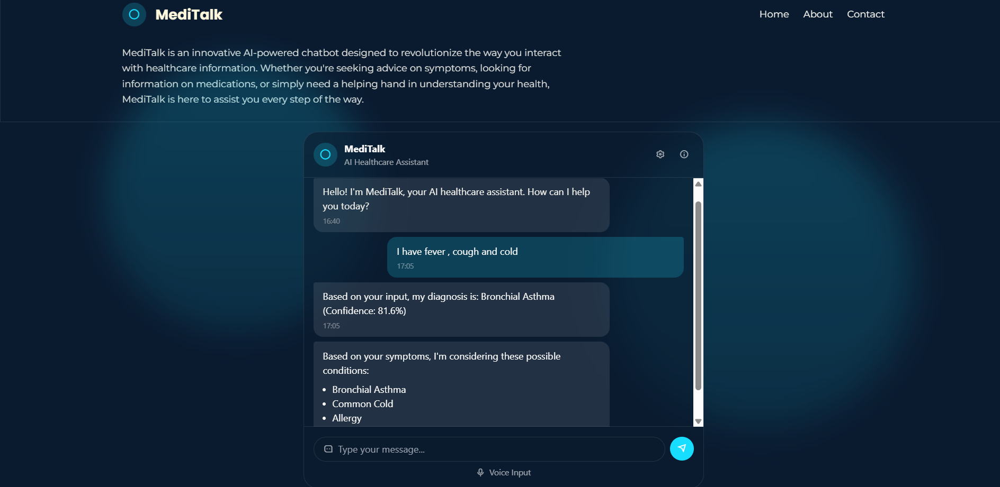

# MediTalk - AI Healthcare Assistant using BERT
[](https://www.sbert.net/)


MediTalk is an innovative AI-powered chatbot designed to revolutionize the way users interact with healthcare information. The application uses a fine-tuned Sentence-BERT model to analyze patient symptoms and provide potential medical diagnoses.


## Features

- **Symptom Analysis**: Users can describe their symptoms in natural language
- **AI-Powered Diagnosis**: Utilizes a fine-tuned transformer model to classify symptoms
- **Multiple Conditions**: Provides top 3 potential conditions based on symptom description
- **Confidence Scoring**: Shows confidence percentage for the primary diagnosis
- **Responsive UI**: Modern, user-friendly interface with smooth animations

## Technology Stack

### Frontend
- HTML5, CSS3, JavaScript
- TailwindCSS for styling
- Responsive design
- Animated UI components

### Backend
- FastAPI for RESTful API endpoints
- PyTorch and Transformers for the ML model
- CORS middleware for cross-origin requests
- Pydantic for data validation

### ML Model
- Fine-tuned Sentence-BERT model
- Trained on a symptom-disease dataset
- Capable of classifying 1081 medical conditions
- Checkpoint-based model loading

## Training Metrics

| Metric | Value |
|--------|-------|
| Final Validation Accuracy | 83.18% |
| Final F1 Score | 79.06% |
| Training Epochs | 7 |
| Learning Rate | 2e-5 |
| Batch Size | 16 |

## Project Structure

```
meditalk/
├── frontend/
│   ├── index.html       # Main frontend interface
│   └── assets/          # CSS, images, etc.
├── results/
│   ├── checkpoint-2118/ # Latest model checkpoint
│   └── runs/            # Training logs
├── app.py               # FastAPI backend server
├── mapping.json         # Disease ID to name mapping
├── requirements.txt     # Python dependencies
└── README.md            # Project documentation
```

## Getting Started

### Prerequisites

- Python 3.8+
- Node.js and npm (for development)
- 4GB+ RAM for model inference

### Installation

1. Clone the repository
   ```
   git clone https://github.com/yourusername/meditalk.git
   cd meditalk
   ```

2. Install Python dependencies
   ```
   pip install -r requirements.txt
   ```

3. Download the model checkpoint (if not included in repository)
   ```
   # Instructions for downloading model files
   ```

4. Start the backend server
   ```
   python app.py
   ```

5. Open `frontend/index.html` in your browser or serve it using a local server
   ```
   # Example with Python's built-in HTTP server
   cd frontend
   python -m http.server 8000
   ```

6. Access the application at `http://localhost:8000`

## API Endpoints

- `GET /` - Welcome message
- `POST /chat` - Send user symptoms and get diagnosis
- `GET /conditions` - List all supported medical conditions

## Usage Example

```javascript
// Example of calling the API
fetch("http://localhost:5000/chat", {
  method: "POST",
  headers: {
    "Content-Type": "application/json",
  },
  body: JSON.stringify({ message: "I have fever, cough and cold" }),
})
.then(response => response.json())
.then(data => console.log(data));
```

## Disclaimer

MediTalk is designed for informational purposes only and should not replace professional medical advice. Always consult with a healthcare provider for proper diagnosis and treatment.

## Future Improvements

- Conversational history for context-aware diagnoses
- Integration with medical databases for treatment suggestions
- User accounts to track symptom history
- Mobile application development
- Enhanced explanations of potential conditions

## License

[MIT License](LICENSE)

## Acknowledgments

- The Hugging Face team for the Transformers library
- FastAPI for the efficient backend framework
- TailwindCSS for the sleek frontend styling
